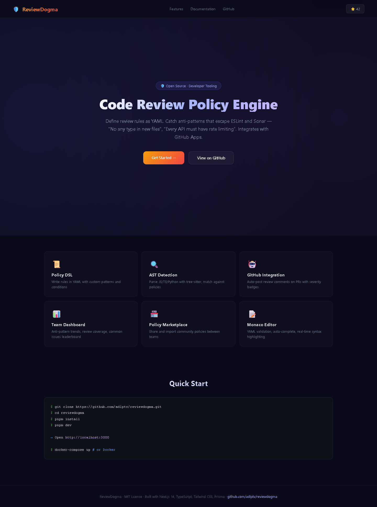

<div align="center">

# 🛡️ ReviewDogma — Code Review Policy Engine

**Stop relying on reviewer memory. Define rules as code.**

[](LICENSE)
[](https://www.typescriptlang.org/)
[](https://nextjs.org/)
</div>

## 📖 What is ReviewDogma?

Code review consistency depends on human reviewers. Anti-patterns slip through because reviewers are tired, distracted, or don't know what to look for. Static analysis tools (ESLint, Sonar) catch syntax issues but miss **business-context anti-patterns**.

ReviewDogma lets you **define review policies as code** (YAML). It reads PR diffs, checks them against your policies, and generates automated review checklists — catching what static analysis misses.

## ✨ Features

- 📜 **Policy DSL** — Define rules in YAML: "No `any` type in new files", "Every API route must have rate limiting"
- 🔍 **AST-Based Detection** — Parse JS/TS/Python with tree-sitter, check against custom rules
- 🤖 **GitHub App Integration** — Auto-post review comments on PRs via webhook
- 📊 **Team Dashboard** — Anti-pattern trends, review coverage stats, common issues leaderboard
- 🏪 **Policy Marketplace** — Share and import community policies
- 📝 **Monaco Editor** — YAML syntax highlighting, live validation, auto-complete
- 🌓 **Dark/Light Theme** — Glassmorphism UI with Framer Motion

## 📸 Screenshots

| Landing Page | Dashboard |
|:---:|:---:|
|  |  |

> 💡 *Run locally to see the full interactive experience: `pnpm dev` then open http://localhost:3000*


## 🏗️ Architecture

```
┌──────────────────────────────────────────┐
│              ReviewDogma                  │
├──────────────┬──────────────┬────────────┤
│   Frontend   │   Backend    │  Engine    │
│  Next.js 14  │  API Routes  │  AST Parser│
│  Monaco      │  Prisma ORM  │  tree-sitter│
│  shadcn/ui   │  GitHub API  │  YAML Parser│
│  recharts    │  Webhook     │  Policy Eval│
└──────────────┴──────────────┴────────────┘
```

## 🚀 Quick Start

```bash
git clone https://github.com/adlptv/reviewdogma.git
cd reviewdogma
pnpm install
pnpm dev
```

Docker:
```bash
docker-compose up
```

## 📝 Example Policy

```yaml
name: "TypeScript Safety Rules"
severity: high
rules:
  - id: "no-explicit-any"
    description: "New files must not use `any` type"
    pattern: ": any"
    excludeExistingFiles: true
    message: "Use a specific type instead of `any`"

  - id: "rate-limit-api"
    description: "Every API route must have rate limiting"
    pattern: "export async function (GET|POST|PUT|DELETE)"
    check: "must_include: 'rateLimit'"
    message: "Add rate limiting middleware to this route"

  - id: "no-console-production"
    description: "No console.log in production code"
    pattern: "console\\.log"
    excludeFiles: ["*.test.*", "*.spec.*"]
```

## 📡 API Endpoints

| Method | Endpoint | Description |
|--------|----------|-------------|
| GET/POST | `/api/policies` | List/create policies |
| GET/PUT/DELETE | `/api/policies/[id]` | Manage policy |
| POST | `/api/policies/validate` | Validate YAML syntax |
| POST | `/api/analyze` | Analyze diff against policies |
| POST | `/api/webhook/github` | GitHub webhook receiver |
| GET | `/api/dashboard/stats` | Dashboard statistics |
| GET | `/api/marketplace` | Community policies |
| GET | `/api/health` | Health check |

## 🔒 Security

- ✅ Zod validation all routes
- ✅ GitHub webhook secret verification (timing-safe)
- ✅ Rate limiting
- ✅ Helmet.js headers
- ✅ Input sanitization

## 📄 License

MIT © [adlptv](https://github.com/adlptv)

---

⭐ Star if this helps your team review better!
